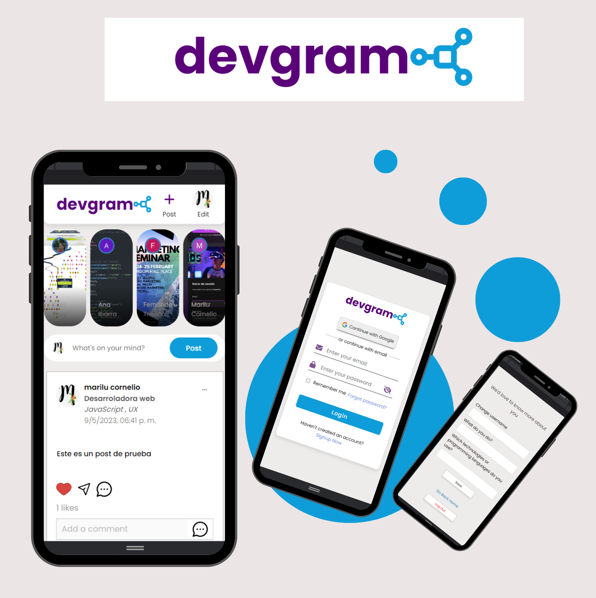

# DEVGRAM 📱🌎

Devgram es una app que pretende conectar a toda aquella persona interesada en el sector tecnológico.

Esta red social permite conectar a las personas que están dentro de la aplicación y que puedan interactuar por medio de la creación de posts, likes y compartir. Los usuarios podrán identificar a aquellos personas con las que quieran conectar por medio de la personalización de su perfil, la cual, ésta permite agregar una posición laboral y en su caso, tecnologías que éste mismo utilice, así como también el poder cambiar el nombre del usuario y la visualización de su foto de perfil.

</img>

## Índice

- [1. Historias de Usuario](#1-historias-de-usuario)
- [2. Prototipo de Baja Fidelidad](#2-prototipo-de-baja-fidelidad)
- [3. Prototipo de Alta Fidelidad](#3-prototipo-de-alta-fidelidad)
- [4. Test de Usabilidad](#4-test-de-usabilidad)

---

## 1. Historias de Usuario

### Historia de usuario 1

Yo como usuario nuevo quiero poder registrarme ya sea con usuario y contraseña o Google para poder iniciar sesión

- El usuario puede ver mensajes descriptivos si hay errores para ayudar al usuario a corregirlos.
- El usuario tiene un ID único
- El usuario accede a la vista de login
- El usuario se puede registrar por correo y contraseña
- El usuario puede registrarse por medio de una cuenta de Google
- El usuario puede descubrir y ocultar su contraseña

### Historia de usuario 2

Yo como usuario de devgram quiero poder publicar un post para compartir información o lo que desee.

- El usuario no puede publicar si no existe contenido en el input
- El usuario puede publicar un post
- El usuario puede acceder a un menú desplegable de opciones de editar y eliminar post
- El usuario puede acceder a un ícono para poder eliminar un post específico
- El usuario verá un mensaje de confirmación antes de eliminar el post
- El usuario puede acceder a un ícono para poder editar un post

### Historia de usuario 3

Yo como usuario de la aplicación puedo dar like, quitar like y ver el conteo de likes para poder ver dar like a publicaciones que me gustan y ver cuantos likes tengo en mis publicaciones y de los demás.

- El usuario puede dar y quitar like a una publicación
- El usuario puede ver el conteo de likes
- El usuario puede quitar los likes que a dado anteriormente
- El usaurio puede ver una animación al dar like a cualquier publicación
- El usuario puede ver un corazón rojo si a dado like a una publicación y sino verá un corazón sin pintar

### Historia de usuario 4

Yo como usuario quiero poner mi ocupación y los lenguajes o tecnologías que manejo en la aplicación para poder personalizar mi perfil además de ver de los demás usuarios de la aplicación.

- El usuario puede editar y actualizar su perfil
- El usuario puede ver en tiempo real la actualización de su perfil
- El usuario puede editar un campo o varios campos de su perfil
- El usuario puede ver la ocupación y los lenguajes o tecnologías que dominan otros usuarios de la aplicación.

**Todas nuestras historias de usuario, cumplen los las siguientes definiciones de terminado:**

- Se recibió code review de 3 compañeras.
- Se realizó test unitarios y, además, hemos testeado el producto manualmente.
- Hicimos tests de usabilidad e incorporaste el feedback del usuario.
- Desplegamos la aplicación (Netlify) y hemos etiquetado su versión (git tag).

## 2. Prototipo de Baja Fidelidad

# 3. Prototipo de Alta Fidelidad

Haz [clic aquí](https://www.figma.com/proto/NRtAsOSPxdDybsrkv4nUnO/Untitled?type=design&node-id=1-2&scaling=scale-down&page-id=0%3A1&starting-point-node-id=1%3A2) o sobre la imagen para interactuar con el prototipo.

# 4. Test de Usabilidad

## Cuestionario de usuarios

| Pregunta                                                                     | %    |
| ---------------------------------------------------------------------------- | ---- |
| Creo que me gustaria usar este sistema con frecuencia                        | 100% |
| Encontramos la página innecesariamente compleja                              | 0%   |
| Encontré el sistema muy engorroso de usar                                    | 0%   |
| Me sentí a gusto y confiado usando el sistema                                | 100% |
| Creo que necesitaria el apoyo de un tecnico para poder utilizar este sistema | %0   |
| Logré ingresar adecuadamente haciendo login                                  | 60%  |
| Logré registrarme e ingresar al home de la app                               | 90%  |
| Los mensajes de error son suficientemente descriptivos                       | 100% |
| Logré realizar un post                                                       | 100% |
| Encontré los botones difíciles de usar                                       | 0%   |
| Logré dar like y quitar los likes de cualquier post                          | 90%  |
| Encontré fácil actualizar mi perfil                                          | 90%  |

## Resultados de testing

## Escenario

Te interesa el sector tecnológico y/o deseas conectar con otras personas que se encuentren en el sector laboral tecnológico, por ello utilizas devgram que te va a permitir registrarte para después iniciar sesión y conectarte con los demás usuarios.

### Tarea 1 (botón Login)

Encuentra e ingresa correctamente

### Tarea 2 (botón Google)

Funciona correctamente, abre PopUp adecuadamente

### Tarea 3 (advertencias)

Se muestra mensaje de error en los inputs para el registro o inicio de sesión y deshabilita el boton de envio pero corrige uno y el boton se habilita por lo tanto le resulta confuso.

**Solución:** El deshabiltado de botón solo se activara sino funciona el match de la contraseña por otra razón no.

### Tarea 4 (botón register)

Se registra correctamente e ingresa al home de la página

### Tarea 5 (botón post)

Realiza un post correctamente y encuentra el botón fácilmente

### Tarea 6 (Likes)

Puede dar like y quitarlos adecuadamente, sin embargo al no tener algo representativo como un color, el usuario no sabe en cual post dió un like

**Solución:** Poner color de relleno rojo al corazón si dió un like y sino el corazón no tendrá color de relleno

## Autoras

- Ana Lucia Ibarra Millan
- María Fernanda Treviño Aguilar
- Katherina Marilu Cornelio Zárate
