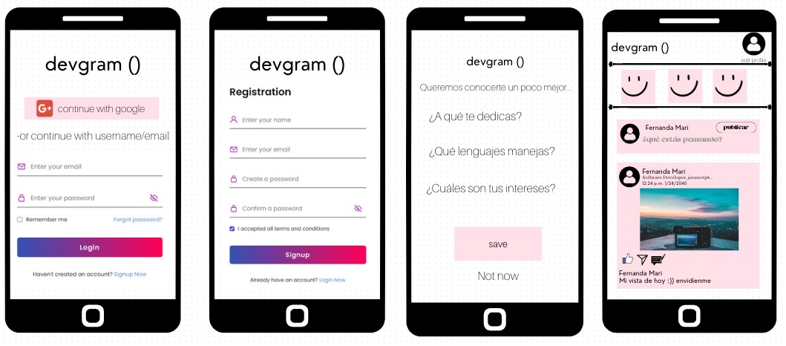
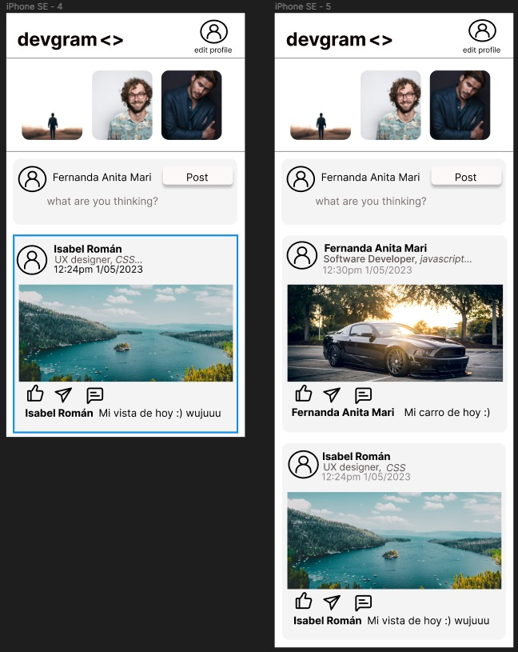
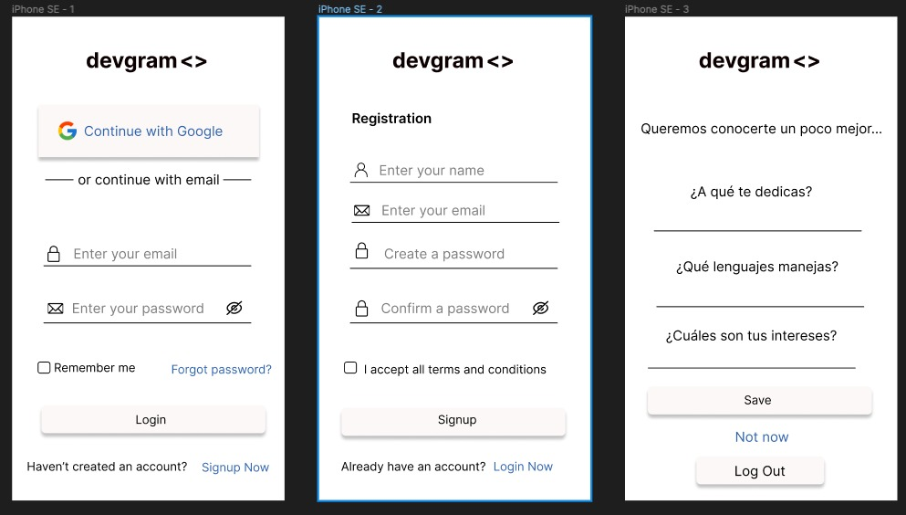

# NAME DEVGRAM

# DESCRIPTION DEVGRAM fue creada para el proyecto Social-Network de Laboratoria. Devgram es una app que pretende conectar a toda aquella persona interesada o que esté dentro del sector Tecnológico.

# UI/UX DEVGRAM permite conectar a las personas que están dentro de la aplicación y que éstas puedan interactuar por medio de la creación de posts, likes y compartir. Los usuarios podrán identificar a aquellos personas con las que quieran conectar por medio de la personalización de su perfil, la cual, ésta permite agregar una posición laboral y en su caso, tecnologías que éste mismo utilice, así como también el poder cambiar el nombre del usuario y la visualización de su foto de perfil. 

# VISUAL MOCKUP: Propuesta de diseño de baja fidelidad 

# VISUAL MOCKUP: Propuesta de diseño de alta fidelidad

# DESCRIPTION En la primera vista: Contiene el formulario de login y el inicio de sesión con Google que a la vez, éste mismo permite realizar un registro. También, en ésta misma se encuentra la opción de crear una cuenta con e-mail y user-name, aceptando los términos y condiciones de la aplicación.

## Segunda vista: Una vez que el usuario ya se haya registrado o bien, haya inciaido sesión, se podrá redirigir a Home en la cual el usuario podrá interactuar con su feed, crear posts, ver posts de otros usuarios, dar likes, quitar likes y compartir. Si el usuario aún no ha guardado la información como su posición laboral y tecnologías que éste mismo maneja, podrá hacerlo haciendo click a su foto de perfil.

## Tercera vista: Una vez que el usuario haya dado click a su foto de perfil podrá pasar a un formulario en el que se le preguntará si gusta restablecer su nombre, asignarse una posición y describir las tecnologías que utiliza las cuales podrá guardar con el botón de 'Save'. Si al usuario no le interesa realizar estos cambios entonces podrá regresar a Home mediante el botón 'Go back Home' o bien, podrá salir de la aplicación mediante el botón 'Logout'.

# AUTHORS Katherina Marilu Cornelio Zárate, Ana Lucia Ibarra Millan y María Fernanda Treviño Aguilar  
